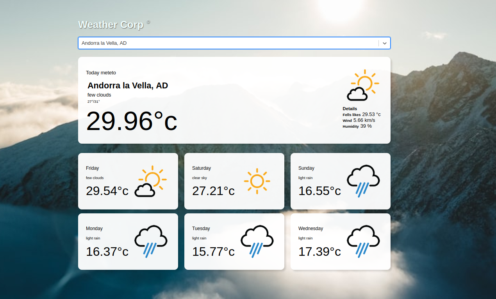

# Weather App

This weather app is powered by OpenWeather data and developed using React. It was created as part of the learning process at BeCode.org (Liège).

## Overview

The Weather App allows users to enter a city and displays the weather forecast for the next 5 days. It leverages OpenWeather data to retrieve weather information.

## Live Demo

You can access the application using the following links:

- [Netlify](#) (Live demo of the Weather App)
- [GitHub](#) (GitHub repository for the Weather App)

## Features

- Enter a city name to retrieve the weather forecast
- Display the weather forecast for the next 5 days
- Display a picture of the choosen city

## Ressources

The development of this Weather App was made possible by the documentation resources provided by :

- [OpenWeather API](https://openweathermap.org/api)
- [GeoDB Cities API](https://rapidapi.com/wirefreethought/api/geodb-cities/) 
- [React](https://reactjs.org/)
- [OpenClassrooms](https://openclassrooms.com/) 
- [freeCodeCamp](https://www.freecodecamp.org/) 
